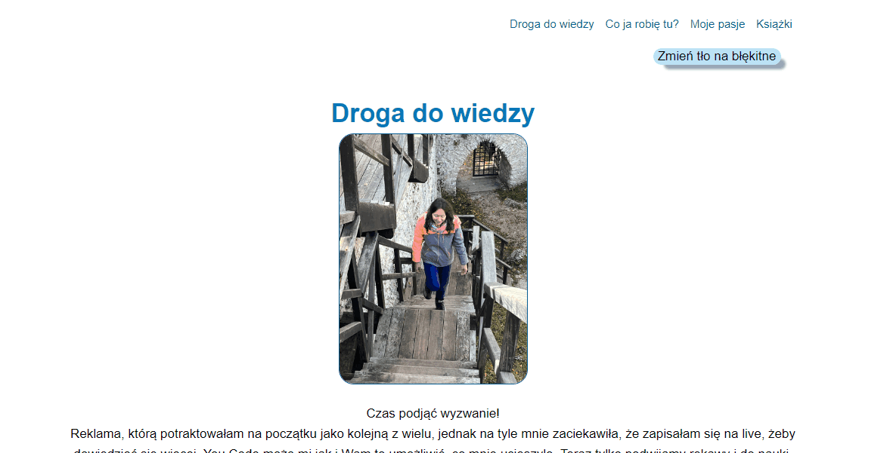

# Karolina Jasiówka

## Website link
[See my page](https://karolinaj33.github.io/Homepage/)
## Demo

## Description
This is my first website made as part of the FrontEnd Developer course. I'm still developing and learning👩‍💻. 
## How to work
You can change themes from white to blue by clicing ont the button.
## Technologies used
- HTML
- Normalize
- CSS
- JavaScript
- ES6+ features
- Flexbox
- BEM convention
- GIT
- Markdown
